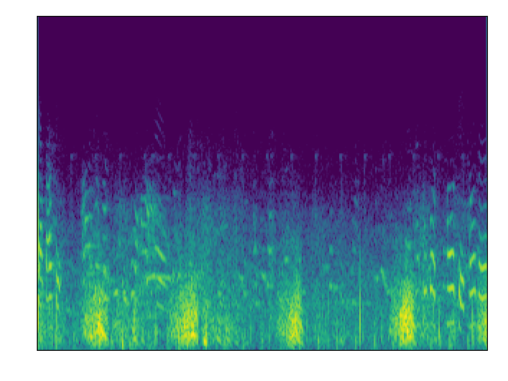
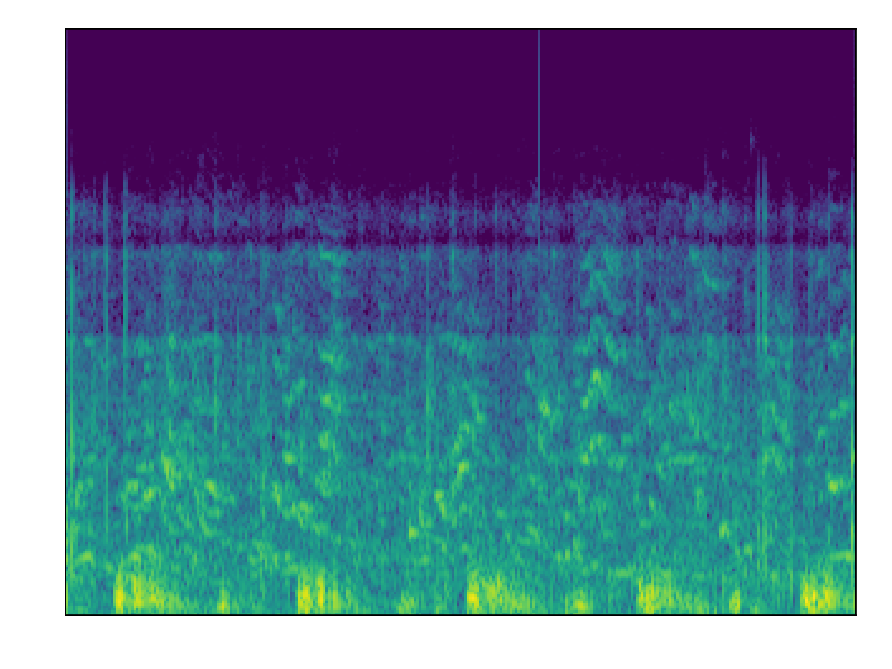
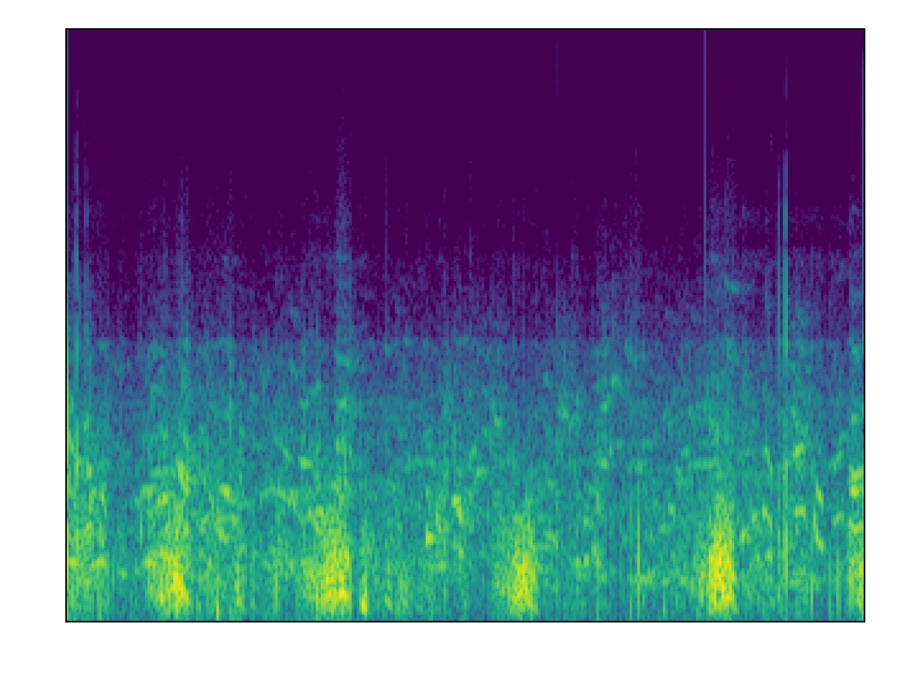
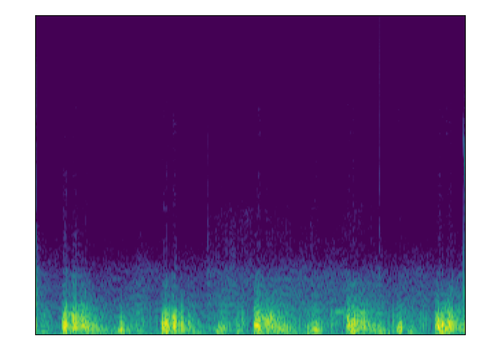
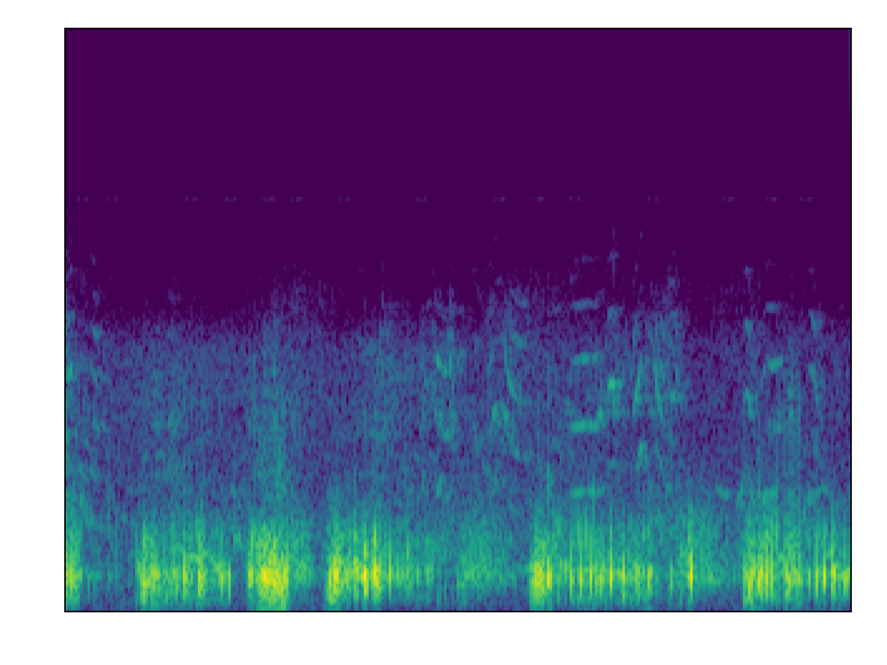
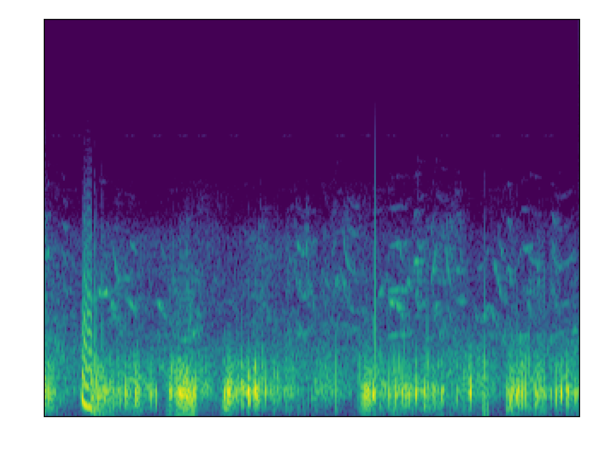
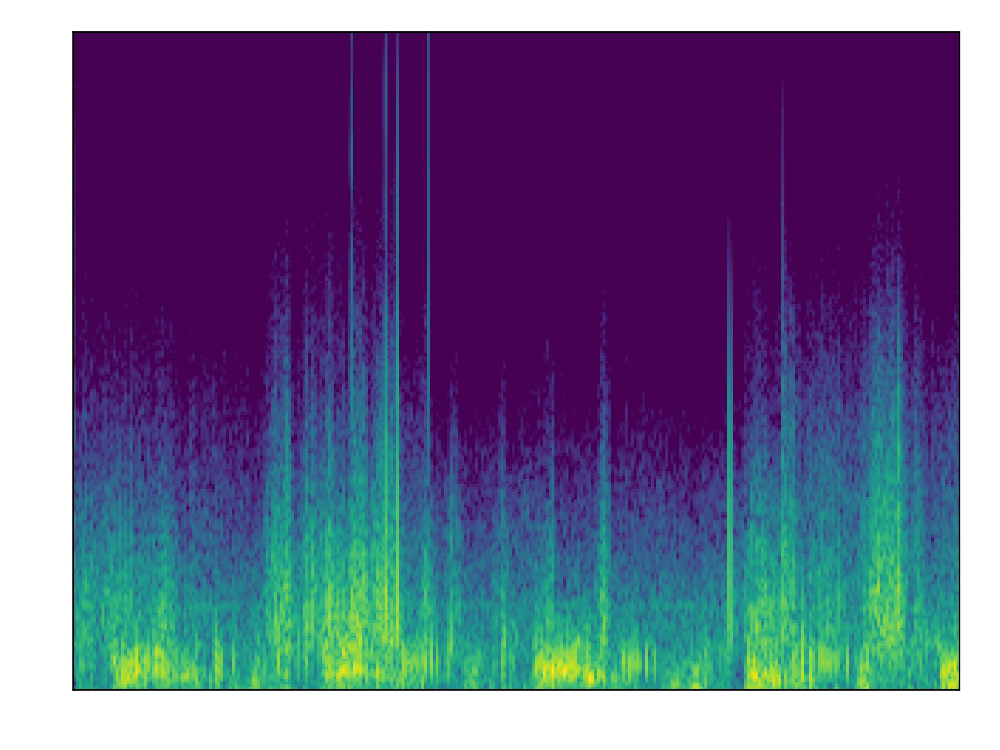
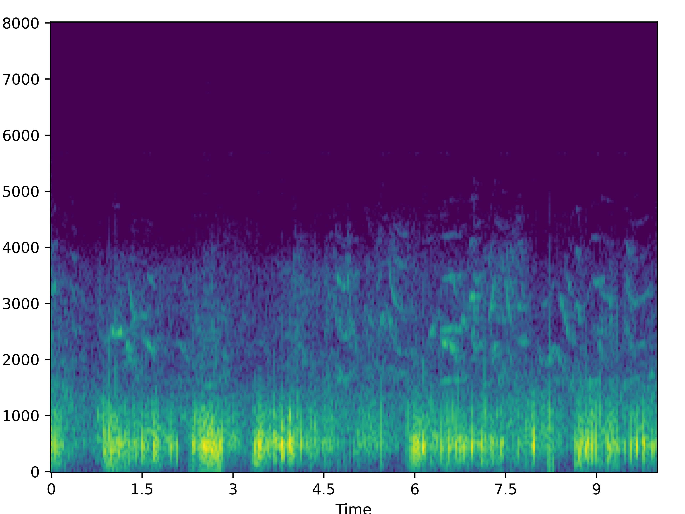

Deep learning techniques have shown promising results in automatic respiratory sound classification. However, distinguishing respiratory sounds in real world noisy conditions pose challenges for the system to be used in clinical settings. Instead of noise injection augmentation that is conventionally done, we propose an audio enhancement (AE) pipeline prior to the respiratory sound classification system. Our AE pipeline is an adversarial network that is trained on real-world clinical noise.
Integrating this pipeline improved the ICBHI classification score by 4.24% on ICBHI respiratory sound dataset and by 3.57% on our recently-collected Formosa Archive of Breath Sounds (FABS) in multi-class noisy scenarios, compared to the baseline method of noise injection data augmentation. More importantly, the enhanced audio aids adoption by clinicians. In our physician validation study, we quantitatively demonstrate improvements in efficiency, diagnostic confidence, and trust during model-assisted diagnosis with our system over raw noisy recordings. Workflows integrating enhanced audio increased 11.61% diagnostic sensitivity and reached high-confidence diagnoses. Our system showcases audio enhancement as an effective methodology for increasing robustness and clinical utility of AI-assisted respiratory sound analysis. 

## Normal Samples: 

We recommend using headphones for this section.

<!-- | Target                                                                    |Noisy                                                                      |  MANNER  | CMGAN|
|---------------------------------------------------------------------------|---------------------------------------------------------------------------|----------|------|
|                                          |                                          |                                          |                                         |
| <audio src="samples/Crackle/C0_clean.wav" controls="" preload=""></audio> | <audio src="samples/Crackle/C0_noisy.wav" controls="" preload=""></audio> |<audio src="samples/Crackle/C0_MANNER.wav" controls="" preload=""></audio>|<audio src="samples/Crackle/C0_CMGAN.wav" controls="" preload=""></audio>|
|                                          |                                          |                                          |                                         |
| <audio src="samples/Crackle/C1_clean.wav" controls="" preload=""></audio> | <audio src="samples/Crackle/C1_noisy.wav" controls="" preload=""></audio> |<audio src="samples/Crackle/C1_MANNER.wav" controls="" preload=""></audio>|<audio src="samples/Crackle/C1_CMGAN.wav" controls="" preload=""></audio>|
|                                          |                                          |                                          |                                         |
| <audio src="samples/Crackle/C2_clean.wav" controls="" preload=""></audio> | <audio src="samples/Crackle/C2_noisy.wav" controls="" preload=""></audio> |<audio src="samples/Crackle/C2_MANNER.wav" controls="" preload=""></audio>|<audio src="samples/Crackle/C2_CMGAN.wav" controls="" preload=""></audio>|
|                                          |                                          |                                          |                                         |
| <audio src="samples/Crackle/C3_clean.wav" controls="" preload=""></audio> | <audio src="samples/Crackle/C3_noisy.wav" controls="" preload=""></audio> |<audio src="samples/Crackle/C3_MANNER.wav" controls="" preload=""></audio>|<audio src="samples/Crackle/C3_CMGAN.wav" controls="" preload=""></audio>|
|                                          |                                          |                                          |                                         |
| <audio src="samples/Crackle/C4_clean.wav" controls="" preload=""></audio> | <audio src="samples/Crackle/C4_noisy.wav" controls="" preload=""></audio> |<audio src="samples/Crackle/C4_MANNER.wav" controls="" preload=""></audio>|<audio src="samples/Crackle/C4_CMGAN.wav" controls="" preload=""></audio>| -->

## Crackle Samples:

We recommend using headphones for this section.

|          | Target                                                                    |Noisy                                                                      |  MANNER  | CMGAN|
|----------|---------------------------------------------------------------------------|---------------------------------------------------------------------------|----------|------|
| Sample C0|                                          |                                          |                                          |                                         |
|          | <audio src="samples/Crackle/C0_clean.wav" controls="" preload=""></audio> | <audio src="samples/Crackle/C0_noisy.wav" controls="" preload=""></audio> |<audio src="samples/Crackle/C0_MANNER.wav" controls="" preload=""></audio>|<audio src="samples/Crackle/C0_CMGAN.wav" controls="" preload=""></audio>|
| Sample C1|                                          |                                          |                                          |                                         |
|          | <audio src="samples/Crackle/C1_clean.wav" controls="" preload=""></audio> | <audio src="samples/Crackle/C1_noisy.wav" controls="" preload=""></audio> |<audio src="samples/Crackle/C1_MANNER.wav" controls="" preload=""></audio>|<audio src="samples/Crackle/C1_CMGAN.wav" controls="" preload=""></audio>|
| Sample C2|                                          |                                          |                                          |                                         |
|          | <audio src="samples/Crackle/C2_clean.wav" controls="" preload=""></audio> | <audio src="samples/Crackle/C2_noisy.wav" controls="" preload=""></audio> |<audio src="samples/Crackle/C2_MANNER.wav" controls="" preload=""></audio>|<audio src="samples/Crackle/C2_CMGAN.wav" controls="" preload=""></audio>|
| Sample C3|                                          |                                          |                                          |                                         |
|          | <audio src="samples/Crackle/C3_clean.wav" controls="" preload=""></audio> | <audio src="samples/Crackle/C3_noisy.wav" controls="" preload=""></audio> |<audio src="samples/Crackle/C3_MANNER.wav" controls="" preload=""></audio>|<audio src="samples/Crackle/C3_CMGAN.wav" controls="" preload=""></audio>|
| Sample C4|                                          |                                          |                                          |                                         |
|          | <audio src="samples/Crackle/C4_clean.wav" controls="" preload=""></audio> | <audio src="samples/Crackle/C4_noisy.wav" controls="" preload=""></audio> |<audio src="samples/Crackle/C4_MANNER.wav" controls="" preload=""></audio>|<audio src="samples/Crackle/C4_CMGAN.wav" controls="" preload=""></audio>|

## Wheeze Samples: 

We recommend using headphones for this section.

<!-- | Target                                                                    |Noisy                                                                      |  MANNER  | CMGAN|
|---------------------------------------------------------------------------|---------------------------------------------------------------------------|----------|------|
|                                          |                                          |                                          |                                         |
| <audio src="samples/Crackle/C0_clean.wav" controls="" preload=""></audio> | <audio src="samples/Crackle/C0_noisy.wav" controls="" preload=""></audio> |<audio src="samples/Crackle/C0_MANNER.wav" controls="" preload=""></audio>|<audio src="samples/Crackle/C0_CMGAN.wav" controls="" preload=""></audio>|
|                                          |                                          |                                          |                                         |
| <audio src="samples/Crackle/C1_clean.wav" controls="" preload=""></audio> | <audio src="samples/Crackle/C1_noisy.wav" controls="" preload=""></audio> |<audio src="samples/Crackle/C1_MANNER.wav" controls="" preload=""></audio>|<audio src="samples/Crackle/C1_CMGAN.wav" controls="" preload=""></audio>|
|                                          |                                          |                                          |                                         |
| <audio src="samples/Crackle/C2_clean.wav" controls="" preload=""></audio> | <audio src="samples/Crackle/C2_noisy.wav" controls="" preload=""></audio> |<audio src="samples/Crackle/C2_MANNER.wav" controls="" preload=""></audio>|<audio src="samples/Crackle/C2_CMGAN.wav" controls="" preload=""></audio>|
|                                          |                                          |                                          |                                         |
| <audio src="samples/Crackle/C3_clean.wav" controls="" preload=""></audio> | <audio src="samples/Crackle/C3_noisy.wav" controls="" preload=""></audio> |<audio src="samples/Crackle/C3_MANNER.wav" controls="" preload=""></audio>|<audio src="samples/Crackle/C3_CMGAN.wav" controls="" preload=""></audio>|
|                                          |                                          |                                          |                                         |
| <audio src="samples/Crackle/C4_clean.wav" controls="" preload=""></audio> | <audio src="samples/Crackle/C4_noisy.wav" controls="" preload=""></audio> |<audio src="samples/Crackle/C4_MANNER.wav" controls="" preload=""></audio>|<audio src="samples/Crackle/C4_CMGAN.wav" controls="" preload=""></audio>|                                |                                          |         |      | -->