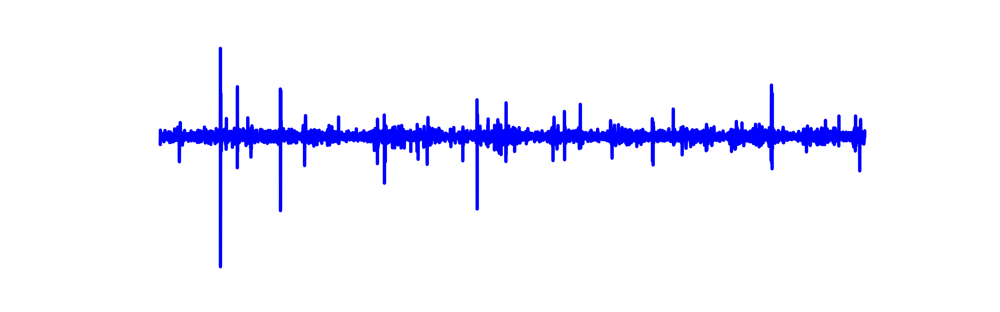

Deep learning techniques have shown promising results in the automatic classification of respiratory sounds. However, accurately distinguishing these sounds in real-world noisy conditions poses challenges for clinical deployment. Additionally, predicting signals with only background noise could undermine user trust in the system. In this study, we propose an audio enhancement (AE) pipeline as a pre-processing step before respiratory sound classification, aiming to improve performance in noisy environments.
Multiple experiments were conducted using different audio enhancement model structures, demonstrating improved classification performance compared to the baseline method of noise injection data augmentation. Specifically, the integration of the AE pipeline resulted in a 2.59\% increase in the ICBHI classification score on the ICBHI respiratory sound dataset and a 2.51\% improvement on our recently collected Formosa Archive of Breath Sounds (FABS) in multi-class noisy scenarios.
Furthermore, a physician validation study assessed the clinical utility of our system. Quantitative analysis revealed enhancements in efficiency, diagnostic confidence, and trust during model-assisted diagnosis with our system compared to raw noisy recordings. Workflows integrating enhanced audio led to an 11.61\% increase in diagnostic sensitivity and facilitated high-confidence diagnoses. Our findings demonstrate that incorporating an audio enhancement algorithm significantly enhances robustness and clinical utility.

## Normal: 

We recommend using headphones for this section.

|          | Noisy | Wave-U-Net | PHASEN |  MANNER  | CMGAN |Target| 
|----------|-------|------------|--------|----------|-------|------|
| |                                  |                                       |                                         |                                         |                                          |                                          |
| 0|                                  |                                       |                                         |                                         |                                          |                                          |
|    |<audio src="samples/Normal/N0_noisy.wav" controls="" preload=""></audio> |<audio src="samples/Normal/N0_WaveUNet.wav" controls="" preload=""></audio>|<audio src="samples/Normal/N0_PHASEN.wav" controls="" preload=""></audio>|<audio src="samples/Normal/N0_MANNER.wav" controls="" preload=""></audio>|<audio src="samples/Normal/N0_CMGAN.wav" controls="" preload=""></audio>|<audio src="samples/Normal/N0_clean.wav" controls="" preload=""></audio> |
| 1|                                  |                                       |                                         |                                         |                                          |                                          |
|    |<audio src="samples/Normal/N1_noisy.wav" controls="" preload=""></audio> |<audio src="samples/Normal/N1_WaveUNet.wav" controls="" preload=""></audio>|<audio src="samples/Normal/N1_PHASEN.wav" controls="" preload=""></audio>|<audio src="samples/Normal/N1_MANNER.wav" controls="" preload=""></audio>|<audio src="samples/Normal/N1_CMGAN.wav" controls="" preload=""></audio>| <audio src="samples/Normal/N1_clean.wav" controls="" preload=""></audio> |
| 2|                                  |                                       |                                         |                                         |                                          |                                         |
|    |  <audio src="samples/Normal/N2_noisy.wav" controls="" preload=""></audio> |<audio src="samples/Normal/N2_WaveUNet.wav" controls="" preload=""></audio>|<audio src="samples/Normal/N2_PHASEN.wav" controls="" preload=""></audio>|<audio src="samples/Normal/N2_MANNER.wav" controls="" preload=""></audio>|<audio src="samples/Normal/N2_CMGAN.wav" controls="" preload=""></audio>|<audio src="samples/Normal/N2_clean.wav" controls="" preload=""></audio> |

## Crackles:

We recommend using headphones for this section.

|          | Target                                                                    |Noisy                                                                      |  MANNER  | CMGAN|
|----------|---------------------------------------------------------------------------|---------------------------------------------------------------------------|----------|------|
| 0|                                          |                                          |                                          |                                         |
|    | <audio src="samples/Crackle/C0_clean.wav" controls="" preload=""></audio> | <audio src="samples/Crackle/C0_noisy.wav" controls="" preload=""></audio> |<audio src="samples/Crackle/C0_MANNER.wav" controls="" preload=""></audio>|<audio src="samples/Crackle/C0_CMGAN.wav" controls="" preload=""></audio>|
| 1 |                                          |                                          |                                          |                                         |
|    | <audio src="samples/Crackle/C1_clean.wav" controls="" preload=""></audio> | <audio src="samples/Crackle/C1_noisy.wav" controls="" preload=""></audio> |<audio src="samples/Crackle/C1_MANNER.wav" controls="" preload=""></audio>|<audio src="samples/Crackle/C1_CMGAN.wav" controls="" preload=""></audio>|
| 2 |                                          |                                          |                                          |                                         |
|    | <audio src="samples/Crackle/C2_clean.wav" controls="" preload=""></audio> | <audio src="samples/Crackle/C2_noisy.wav" controls="" preload=""></audio> |<audio src="samples/Crackle/C2_MANNER.wav" controls="" preload=""></audio>|<audio src="samples/Crackle/C2_CMGAN.wav" controls="" preload=""></audio>|

## Wheezes: 

We recommend using headphones for this section.

|          | Target                                                                    |Noisy                                                                      |  MANNER  | CMGAN|
|----------|---------------------------------------------------------------------------|---------------------------------------------------------------------------|----------|------|
| 0|                                          |                                          |                                          |                                         |
|    | <audio src="samples/Wheeze/W0_clean.wav" controls="" preload=""></audio> | <audio src="samples/Wheeze/W0_noisy.wav" controls="" preload=""></audio> |<audio src="samples/Wheeze/W0_MANNER.wav" controls="" preload=""></audio>|<audio src="samples/Wheeze/W0_CMGAN.wav" controls="" preload=""></audio>|
| 1 |                                          |                                          |                                          |                                         |
|    | <audio src="samples/Wheeze/W1_clean.wav" controls="" preload=""></audio> | <audio src="samples/Wheeze/W1_noisy.wav" controls="" preload=""></audio> |<audio src="samples/Wheeze/W1_MANNER.wav" controls="" preload=""></audio>|<audio src="samples/Wheeze/W1_CMGAN.wav" controls="" preload=""></audio>|
| 2 |                                          |                                          |                                          |                                         |
|    | <audio src="samples/Wheeze/W2_clean.wav" controls="" preload=""></audio> | <audio src="samples/Wheeze/W2_noisy.wav" controls="" preload=""></audio> |<audio src="samples/Wheeze/W2_MANNER.wav" controls="" preload=""></audio>|<audio src="samples/Wheeze/W2_CMGAN.wav" controls="" preload=""></audio>|
