This is the official demo website for "Improving the Robustness and Clinical Applicability of Automatic Respiratory Sound Classification Using Deep Learning–Based Audio Enhancement: Algorithm Development and Validation," in JMIR AI.

Our paper: https://ai.jmir.org/2025/1/e67239/

### Abstract
#### Background: 
Deep learning techniques have shown promising results in the automatic classification of respiratory sounds. However, accurately distinguishing these sounds in real-world noisy conditions poses challenges for clinical deployment. In addition, predicting signals with only background noise could undermine user trust in the system.

#### Objective: 
This study aimed to investigate the feasibility and effectiveness of incorporating a deep learning–based audio enhancement preprocessing step into automatic respiratory sound classification systems to improve robustness and clinical applicability.

#### Methods: 
We conducted extensive experiments using various audio enhancement model architectures, including time-domain and time-frequency–domain approaches, in combination with multiple classification models to evaluate the effectiveness of the audio enhancement module in an automatic respiratory sound classification system. The classification performance was compared against the baseline noise injection data augmentation method. These experiments were carried out on 2 datasets: the International Conference in Biomedical and Health Informatics (ICBHI) respiratory sound dataset, which contains 5.5 hours of recordings, and the Formosa Archive of Breath Sound dataset, which comprises 14.6 hours of recordings. Furthermore, a physician validation study involving 7 senior physicians was conducted to assess the clinical utility of the system.

#### Results: 
The integration of the audio enhancement module resulted in a 21.88% increase with P<.001 in the ICBHI classification score on the ICBHI dataset and a 4.1% improvement with P<.001 on the Formosa Archive of Breath Sound dataset in multi-class noisy scenarios. Quantitative analysis from the physician validation study revealed improvements in efficiency, diagnostic confidence, and trust during model-assisted diagnosis, with workflows that integrated enhanced audio leading to an 11.61% increase in diagnostic sensitivity and facilitating high-confidence diagnoses.

#### Conclusions: 
Incorporating an audio enhancement algorithm significantly enhances the robustness and clinical utility of automatic respiratory sound classification systems, improving performance in noisy environments and fostering greater trust among medical professionals.

## Normal: 

We recommend using headphones for this section.

|          | Noisy | Wave-U-Net | PHASEN |  MANNER  | CMGAN |Target| 
|----------|-------|------------|--------|----------|-------|------|
| |                                  |                                       |                                         |                                         |                                          |                                          |
| 0|                                  |                                       |                                         |                                         |                                          |                                          |
|    |<audio src="samples/Normal/N0_noisy.wav" controls="" preload=""></audio> |<audio src="samples/Normal/N0_WaveUNet.wav" controls="" preload=""></audio>|<audio src="samples/Normal/N0_PHASEN.wav" controls="" preload=""></audio>|<audio src="samples/Normal/N0_MANNER.wav" controls="" preload=""></audio>|<audio src="samples/Normal/N0_CMGAN.wav" controls="" preload=""></audio>|<audio src="samples/Normal/N0_clean.wav" controls="" preload=""></audio> |
| |                                  |                                       | 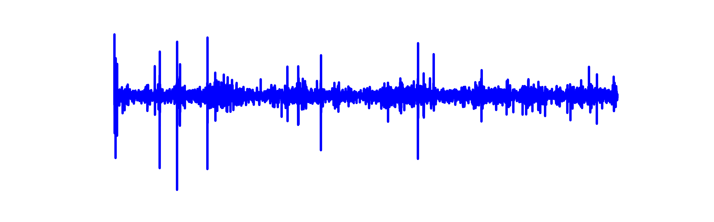                                        | 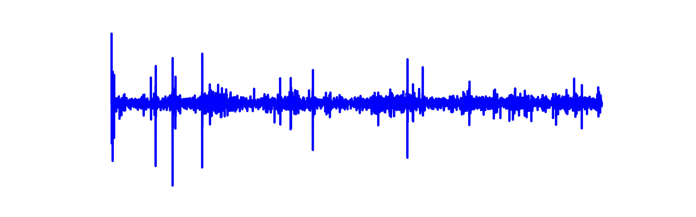                                        | 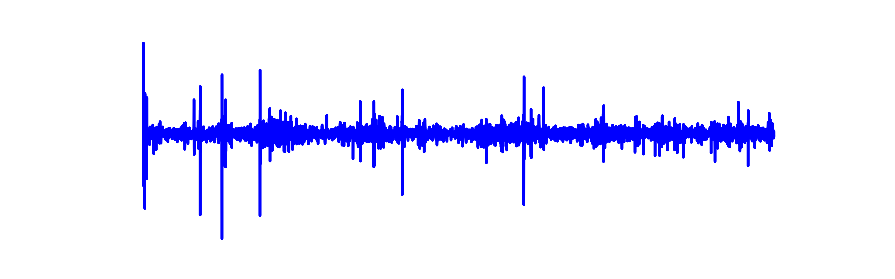                                         |                                          |
| 1|                                  |                                       |                                         |                                         |                                          |                                          |
|    |<audio src="samples/Normal/N1_noisy.wav" controls="" preload=""></audio> |<audio src="samples/Normal/N1_WaveUNet.wav" controls="" preload=""></audio>|<audio src="samples/Normal/N1_PHASEN.wav" controls="" preload=""></audio>|<audio src="samples/Normal/N1_MANNER.wav" controls="" preload=""></audio>|<audio src="samples/Normal/N1_CMGAN.wav" controls="" preload=""></audio>| <audio src="samples/Normal/N1_clean.wav" controls="" preload=""></audio> |
| |                                  |                                       |                                         | 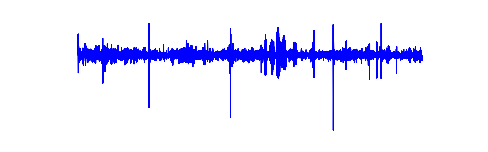                                        | 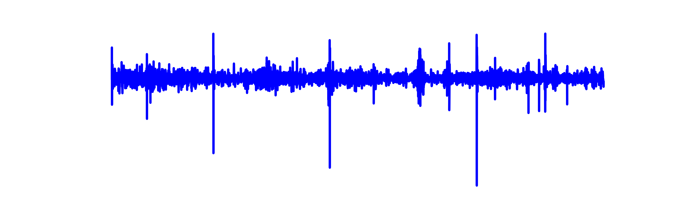                                         |                                          |
| 2|                                  |                                       |                                         |                                         |                                          |                                         |
|    |  <audio src="samples/Normal/N2_noisy.wav" controls="" preload=""></audio> |<audio src="samples/Normal/N2_WaveUNet.wav" controls="" preload=""></audio>|<audio src="samples/Normal/N2_PHASEN.wav" controls="" preload=""></audio>|<audio src="samples/Normal/N2_MANNER.wav" controls="" preload=""></audio>|<audio src="samples/Normal/N2_CMGAN.wav" controls="" preload=""></audio>|<audio src="samples/Normal/N2_clean.wav" controls="" preload=""></audio> |

## Crackles:

We recommend using headphones for this section.

|          | Noisy | Wave-U-Net | PHASEN |  MANNER  | CMGAN |Target| 
|----------|-------|------------|--------|----------|-------|------|
| |                                  | 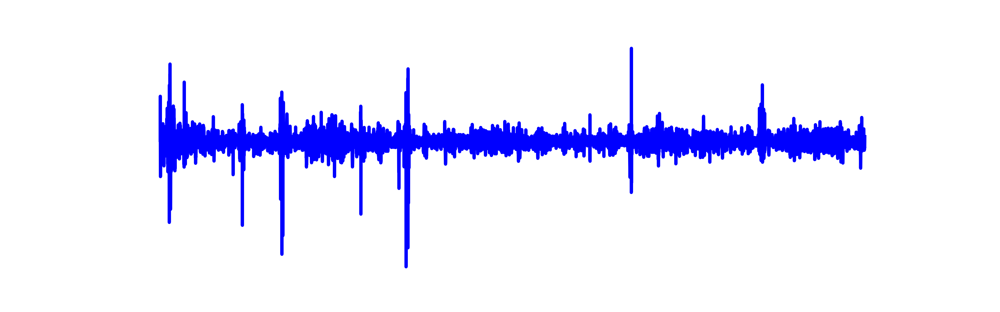                                      | 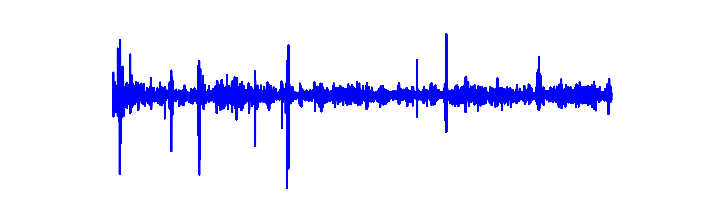                                        |                                         | 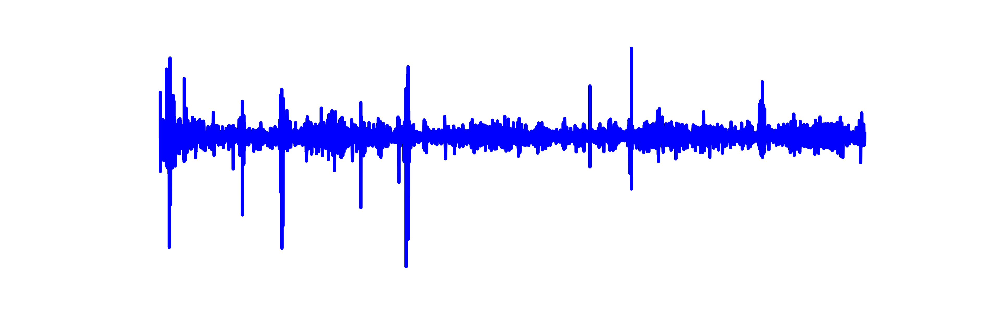                                         | 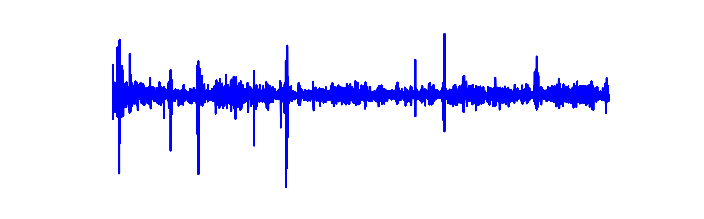                                         |
| 0|                                  |                                       |                                         |                                         |                                          |                                          |
|    |<audio src="samples/Crackle/C0_noisy.wav" controls="" preload=""></audio> |<audio src="samples/Crackle/C0_WaveUNet.wav" controls="" preload=""></audio>|<audio src="samples/Crackle/C0_PHASEN.wav" controls="" preload=""></audio>|<audio src="samples/Crackle/C0_MANNER.wav" controls="" preload=""></audio>|<audio src="samples/Crackle/C0_CMGAN.wav" controls="" preload=""></audio>|<audio src="samples/Crackle/C0_clean.wav" controls="" preload=""></audio> |
| |                                  | 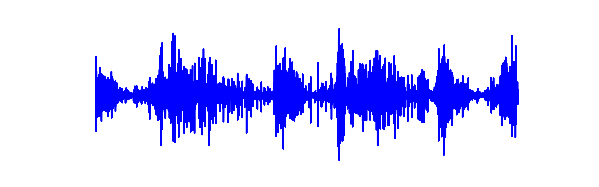                                      | 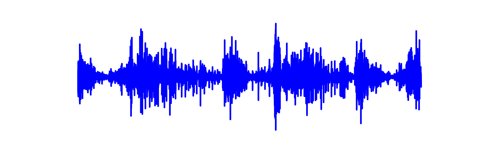                                        | 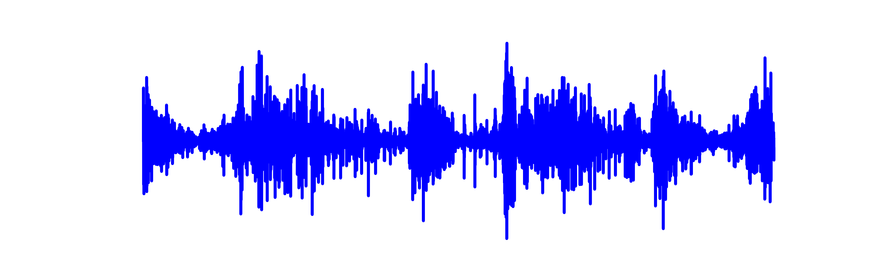                                        |                                          | 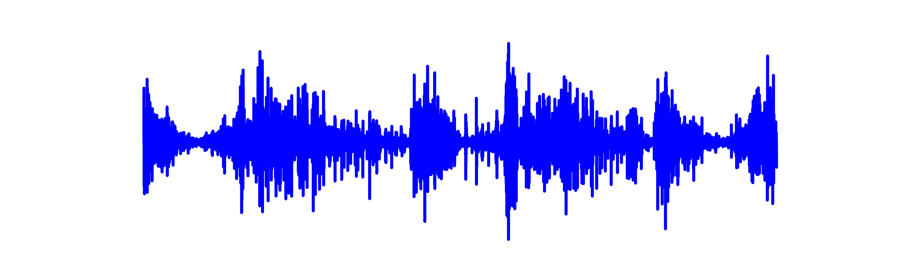                                         |
| 1|                                  |                                       |                                         |                                         |                                          |                                          |
|    |<audio src="samples/Crackle/C1_noisy.wav" controls="" preload=""></audio> |<audio src="samples/Crackle/C1_WaveUNet.wav" controls="" preload=""></audio>|<audio src="samples/Crackle/C1_PHASEN.wav" controls="" preload=""></audio>|<audio src="samples/Crackle/C1_MANNER.wav" controls="" preload=""></audio>|<audio src="samples/Crackle/C1_CMGAN.wav" controls="" preload=""></audio>|<audio src="samples/Crackle/C1_clean.wav" controls="" preload=""></audio> |
| |                                  |                                       |                                         | 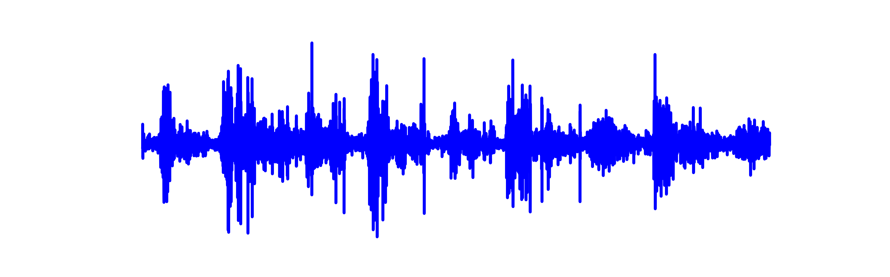                                        |                                          |                                          |
| 2|                                  |                                       |                                         |                                         |                                          |                                          |
|    |<audio src="samples/Crackle/C2_noisy.wav" controls="" preload=""></audio> |<audio src="samples/Crackle/C2_WaveUNet.wav" controls="" preload=""></audio>|<audio src="samples/Crackle/C2_PHASEN.wav" controls="" preload=""></audio>|<audio src="samples/Crackle/C2_MANNER.wav" controls="" preload=""></audio>|<audio src="samples/Crackle/C2_CMGAN.wav" controls="" preload=""></audio>|<audio src="samples/Crackle/C2_clean.wav" controls="" preload=""></audio> |

## Wheezes: 

We recommend using headphones for this section.

|          | Noisy | Wave-U-Net | PHASEN |  MANNER  | CMGAN |Target| 
|----------|-------|------------|--------|----------|-------|------|
| |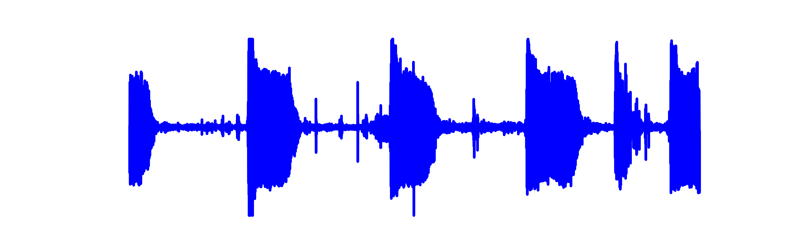                                  | 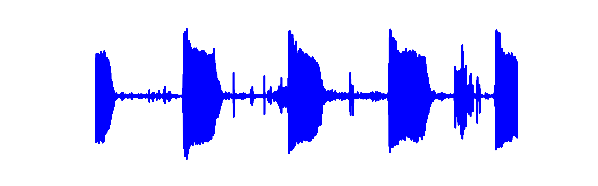                                      |                                         | 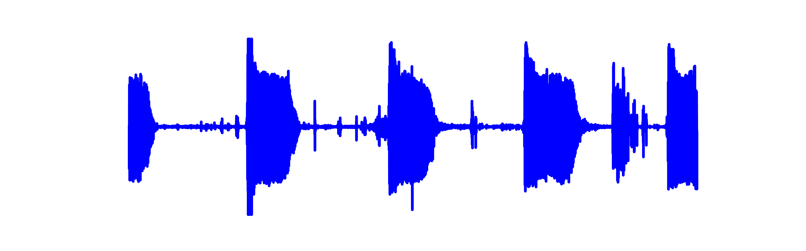                                        | 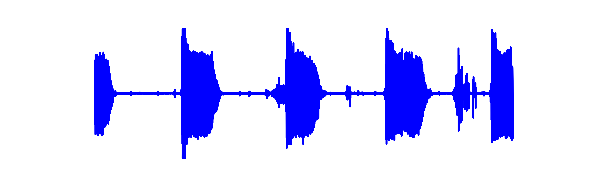                                         | 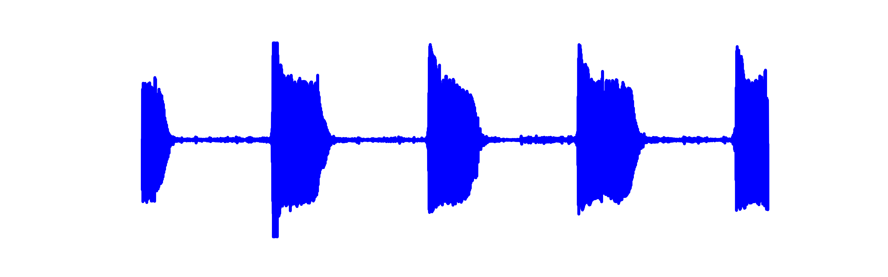                                         |
| 0|                                  |                                       |                                         |                                         |                                          |                                          |
|    |<audio src="samples/Wheeze/W0_noisy.wav" controls="" preload=""></audio> |<audio src="samples/Wheeze/W0_WaveUNet.wav" controls="" preload=""></audio>|<audio src="samples/Wheeze/W0_PHASEN.wav" controls="" preload=""></audio>|<audio src="samples/Wheeze/W0_MANNER.wav" controls="" preload=""></audio>|<audio src="samples/Wheeze/W0_CMGAN.wav" controls="" preload=""></audio>|<audio src="samples/Wheeze/W0_clean.wav" controls="" preload=""></audio> |
| |                                  |                                       | 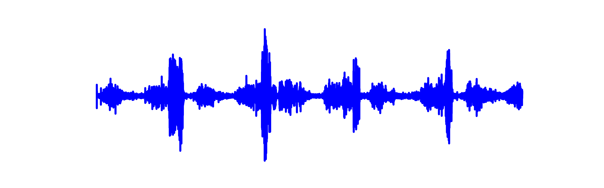                                        |                                         |                                          |                                          |
| 1|                                  |                                       |                                         |                                         |                                          |                                          |
|    |<audio src="samples/Wheeze/W1_noisy.wav" controls="" preload=""></audio> |<audio src="samples/Wheeze/W1_WaveUNet.wav" controls="" preload=""></audio>|<audio src="samples/Wheeze/W1_PHASEN.wav" controls="" preload=""></audio>|<audio src="samples/Wheeze/W1_MANNER.wav" controls="" preload=""></audio>|<audio src="samples/Wheeze/W1_CMGAN.wav" controls="" preload=""></audio>|<audio src="samples/Wheeze/W1_clean.wav" controls="" preload=""></audio> |
| |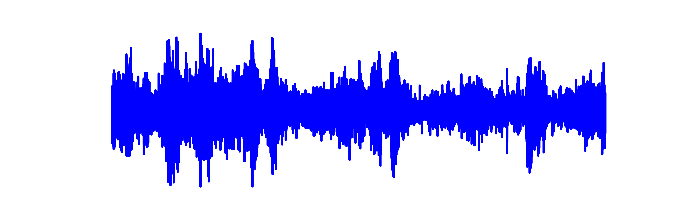                                  |                                       |                                         |                                         |                                          | 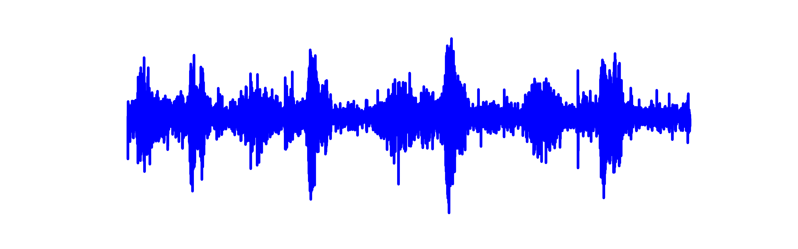                                         |
| 2|                                  |                                       |                                         |                                         |                                          |                                          |
|    |<audio src="samples/Wheeze/W2_noisy.wav" controls="" preload=""></audio> |<audio src="samples/Wheeze/W2_WaveUNet.wav" controls="" preload=""></audio>|<audio src="samples/Wheeze/W2_PHASEN.wav" controls="" preload=""></audio>|<audio src="samples/Wheeze/W2_MANNER.wav" controls="" preload=""></audio>|<audio src="samples/Wheeze/W2_CMGAN.wav" controls="" preload=""></audio>|<audio src="samples/Wheeze/W2_clean.wav" controls="" preload=""></audio> |